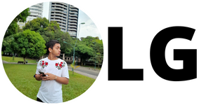

<h1 style="text-align: center;">Luiz Gabriel</h1>

<h2>Paleta de cores usadas</h2>
<ul>
<li>#000000</li>
<li>#ffffff</li>
<li>#F0A500</li>
<li>#2FA4FF</li>
</ul>
<h2>Fontes usadas</h2>
<ul>
<li>Roboto</li>
<li>Open sans</li>
<li>Arvo</li>
<!--
font-family: 'Open Sans', sans-serif;
font-family: 'Roboto', sans-serif;
font-family: 'Arvo', serif;
-->
</ul>
